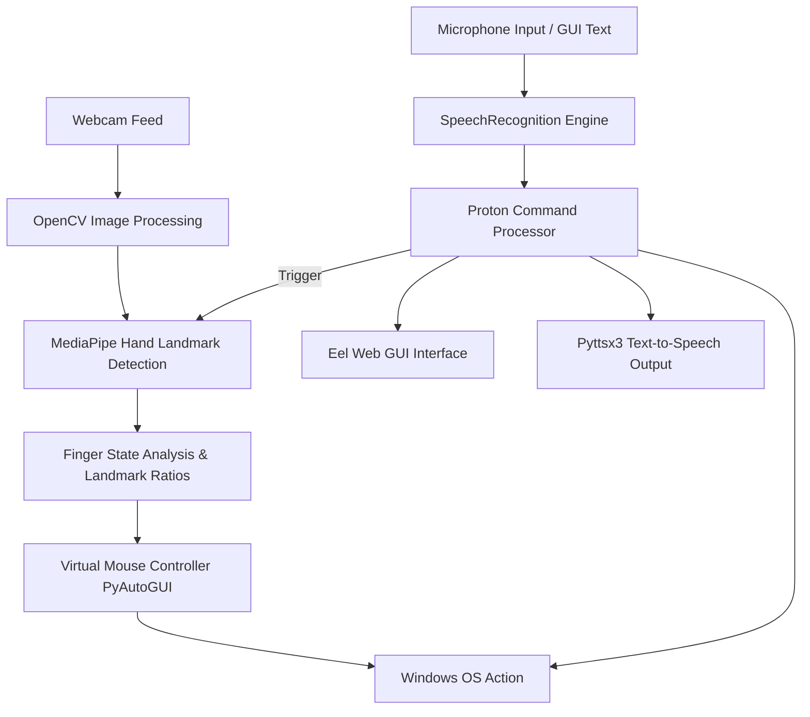

<div align="center">

# 🖐️ Gesture Controlled Virtual Mouse & Voice Assistant 🎙️

<p align="center">
  <b>A Touchless Human-Computer Interaction Framework Powered by Computer Vision & Speech Recognition</b>
</p>

[](https://www.python.org/)
[](https://mediapipe.dev/)
[](https://opencv.org/)
[](https://microsoft.com/windows)
[](LICENSE)

<br/>

[🎥 **Watch YouTube Video Demonstration**](https://www.youtube.com/watch?v=ufm6tfgo-OA)

---

</div>

## 📌 Project Overview

**Gesture Controlled Virtual Mouse & Voice Assistant (*Proton*)** is an artificial intelligence application that transforms standard webcams and microphones into virtual input peripherals. By leveraging real-time hand landmark tracking and speech-to-text processing, the system enables complete touch-free control over mouse navigation, system adjustments (volume & brightness), application execution, and file management on Windows PCs.

---

## ✨ Key Features

### ✋ Hand Gesture Control (Virtual Mouse)
* **Cursor Movement**: Real-time cursor motion mapped to index and middle finger landmarks with velocity-proportional smoothing.
* **Clicking & Dragging**: Intuitive finger postures for Left Click, Right Click, Double Click, and Drag-and-Drop file transfers.
* **Dynamic Pinch Controls**:
  * **Scrolling**: Proportional vertical and horizontal page scrolling using pinch displacement.
  * **System Control**: Dynamic adjustment of system volume (`pycaw`) and screen brightness (`screen-brightness-control`).
* **Dual Detection Modes**: Supports direct hand tracking via MediaPipe as well as uniform color mask tracking for gloved hands.

### 🎙️ Proton Voice Assistant & Web UI
* **Eel Glassmorphism GUI**: Sleek modern desktop widget with live status indicators and real-time chat bubbles.
* **Voice & Text Input Modes**: Execute system commands via voice recognition or fallback text input.
* **System Commands**: Search Google, query locations on Google Maps, execute copy/paste shortcuts, check time/date, and navigate local directories.

---

## 📐 System Architecture



---

## 🖐️ Gesture Reference Guide

<details>
<summary><b>🖐️ Neutral Gesture (Halt)</b></summary>
<br/>
<figure align="center">
  
  <figcaption><b>Open Palm:</b> Neutral gesture used to pause/stop current action.</figcaption>
</figure>
</details>

<details>
<summary><b>🖱️ Move Cursor</b></summary>
<br/>
<figure align="center">
  
  <figcaption><b>Index & Middle Extended:</b> Moves cursor to fingertip midpoint coordinates with smooth dampening.</figcaption>
</figure>
</details>

<details>
<summary><b>👆 Left Click</b></summary>
<br/>
<figure align="center">
  
  <figcaption><b>Middle Finger Bend:</b> Triggers a single left mouse click.</figcaption>
</figure>
</details>

<details>
<summary><b>👉 Right Click</b></summary>
<br/>
<figure align="center">
  
  <figcaption><b>Index Finger Bend:</b> Triggers a single right mouse click.</figcaption>
</figure>
</details>

<details>
<summary><b>✌️ Double Click</b></summary>
<br/>
<figure align="center">
  
  <figcaption><b>Two Fingers Closed:</b> Performs a double click gesture.</figcaption>
</figure>
</details>

<details>
<summary><b>📜 Vertical & Horizontal Scrolling</b></summary>
<br/>
<figure align="center">
  
  <figcaption><b>Minor Hand Pinch:</b> Drag vertical or horizontal pinch distance to scroll pages.</figcaption>
</figure>
</details>

<details>
<summary><b>📦 Drag and Drop</b></summary>
<br/>
<figure align="center">
  
  <figcaption><b>Fist Closure:</b> Holds down mouse button to drag items across directories.</figcaption>
</figure>
</details>

<details>
<summary><b>🔊 Volume & ☀️ Brightness Control</b></summary>
<br/>
<figure align="center">
  
  <figcaption><b>Major Hand Pinch:</b> Pinch vertically to adjust volume; pinch horizontally for screen brightness.</figcaption>
</figure>
</details>

---

## 🎙️ Proton Voice Commands Reference

| Command Phrase | Action Description |
| :--- | :--- |
| `Proton launch gesture recognition` | Turns on webcam tracking and initiates hand gesture mouse control. |
| `Proton stop gesture recognition` | Halts webcam feed and stops gesture tracking. |
| `Proton search {query}` | Opens Google search in Chrome browser. |
| `Proton location` | Prompts for location and opens Google Maps. |
| `Proton list` | Displays files in the active workspace directory. |
| `Proton open {item_number}` | Opens specified file or directory by number index. |
| `Proton back` | Navigates to the parent folder directory. |
| `Proton copy` / `Proton paste` | Executes system clipboard copy/paste shortcuts (`Ctrl+C`, `Ctrl+V`). |
| `Proton exit` / `Proton terminate` | Safely closes the assistant application. |

---

## 🛠️ Technology Stack

* **Language**: Python 3.8 / 3.11
* **Computer Vision**: OpenCV, Google MediaPipe
* **OS Automation**: PyAutoGUI, PyNput, Pycaw (Windows Core Audio), Screen Brightness Control
* **Speech & TTS**: SpeechRecognition, PyAudio, Pyttsx3 (SAPI5 Engine)
* **Frontend GUI**: Eel (Python HTML/JS Bridge), HTML5, CSS3 Glassmorphism

---

## 🚀 Quick Start Guide

### Prerequisites
* Windows OS (10 / 11)
* Connected Webcam & Microphone
* Python 3.8+ (or [uv package manager](https://github.com/astral-sh/uv))

### Installation & Setup

1. **Clone the Repository**:
   ```bash
   git clone https://github.com/YOUR_USERNAME/Gesture-Controlled-Virtual-Mouse.git
   cd Gesture-Controlled-Virtual-Mouse
   ```

2. **Create Virtual Environment**:
   ```powershell
   # Using standard Python
   python -m venv venv
   .\venv\Scripts\activate

   # Or using uv (faster)
   uv venv --python 3.11 venv
   .\venv\Scripts\activate
   ```

3. **Install Dependencies**:
   ```powershell
   pip install -r requirements.txt
   ```

4. **Run the Application**:
   ```powershell
   python src/Proton.py
   ```

---

## 👨‍💻 Original Collaborators

| Collaborator | Links |
| :--- | :--- |
| **Nishiket Bidawat** | [](https://github.com/xenon-19) [](https://www.linkedin.com/in/nishiket-bidawat-74b419193/) |
| **Viral Doshi** | [](https://github.com/Viral-Doshi) [](https://www.linkedin.com/in/viral-doshi-5a7737190/) |
| **Ankit Sharma** | [](https://github.com/ankit-4129) |
| **Parth Sakariya** | [](https://github.com/parth-12) [](https://www.linkedin.com/in/parth-sakariya-1886b2193/) |

---

## 📜 License

This project is licensed under the MIT License - see the [LICENSE](LICENSE) file for details.
